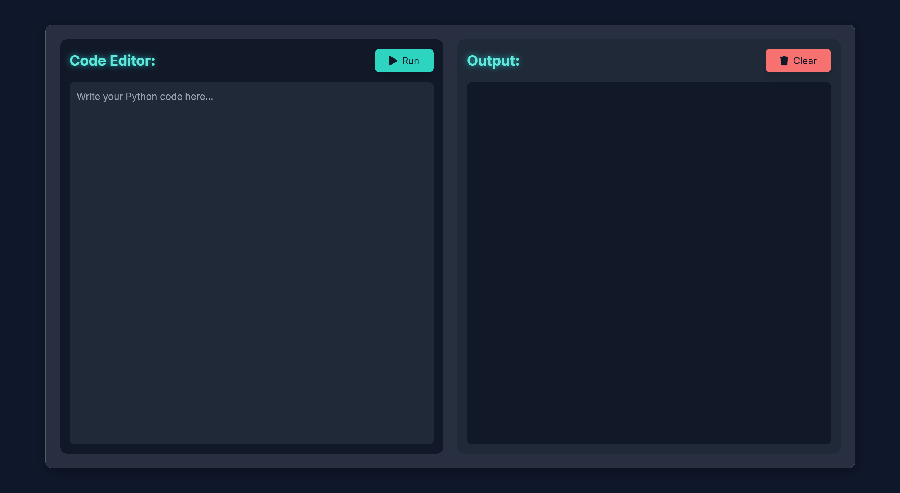
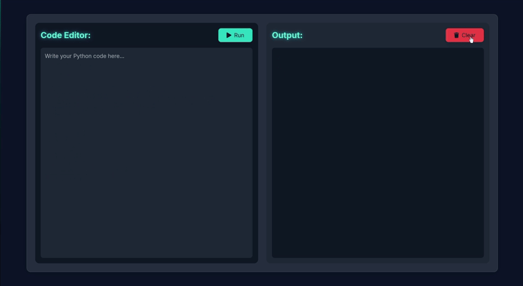

# JAX Web Compiler

A sleek, web-based Python code editor and execution environment with a modern glass-morphic UI design.

## ✨ Features

- **Real-time Python code execution** in a secure sandbox environment
- **Beautiful glass-morphic UI** with neon accents and dark theme
- **Responsive design** that works on various screen sizes
- **Code syntax highlighting** for better readability
- **Error handling and display** for debugging assistance
- **Simple and intuitive interface** for quick code testing



## 🚀 Demo

See JAX Compiler in action:



## 🛠️ Technology Stack

- **Frontend**: HTML, CSS, JavaScript, TailwindCSS
- **Backend**: Flask (Python)
- **Styling**: Glass-morphism design with neon accents
- **Icons**: Font Awesome

## 📋 Prerequisites

- Python 3.6 or higher
- Flask
- Werkzeug
- Flask-CORS

## 🔧 Installation

1. Clone the repository:
```bash
git clone https://github.com/yourusername/jax-compiler.git
cd jax-compiler
```

2. Install the required packages:
```bash
pip install -r requirements.txt
```

3. Run the application:
```bash
python app.py
```

4. Open your browser and navigate to:
```
http://localhost:5000
```

## 🔍 How It Works

1. User writes Python code in the editor panel
2. Code is sent to the Flask backend when the "Run" button is clicked
3. Backend safely executes the code in a sandboxed environment
4. Output or errors are captured and returned to the frontend
5. Results are displayed in the output panel

## 🔐 Security Features

- Code execution is handled with a timeout to prevent infinite loops
- Secure filename handling to prevent path traversal attacks
- Temporary files are properly cleaned up after execution
- Cross-Origin Resource Sharing (CORS) is enabled for API access

## 🎨 UI Features

- **Glass-morphic containers** with backdrop blur effects
- **Neon text accents** for headings and important elements
- **Dark theme** designed for reduced eye strain
- **Responsive layout** that adapts to different screen sizes
- **Code-friendly fonts** for better readability

## 🧩 Project Structure

```
jax-compiler/
├── app.py              # Flask backend application
├── index.html          # Frontend HTML template
├── requirements.txt    # Python dependencies
└── assets/             # Images and other static assets
```

## 🔮 Future Improvements

- Add support for multiple programming languages
- Implement file saving and loading functionality
- Add code sharing capabilities
- Create user accounts for saving code snippets
- Add code completion and intelligent suggestions
- Enable collaborative coding features

## 📜 License

This project is licensed under the MIT License - see the [LICENSE](LICENSE) file for details.

## 🤝 Contributing

Contributions are welcome! Please feel free to submit a Pull Request.

1. Fork the repository
2. Create your feature branch (`git checkout -b feature/amazing-feature`)
3. Commit your changes (`git commit -m 'Add some amazing feature'`)
4. Push to the branch (`git push origin feature/amazing-feature`)
5. Open a Pull Request

## 📞 Contact

If you have any questions or suggestions, please open an issue or contact the repository owner.

---

Made with ❤️ using Flask and modern web technologies
